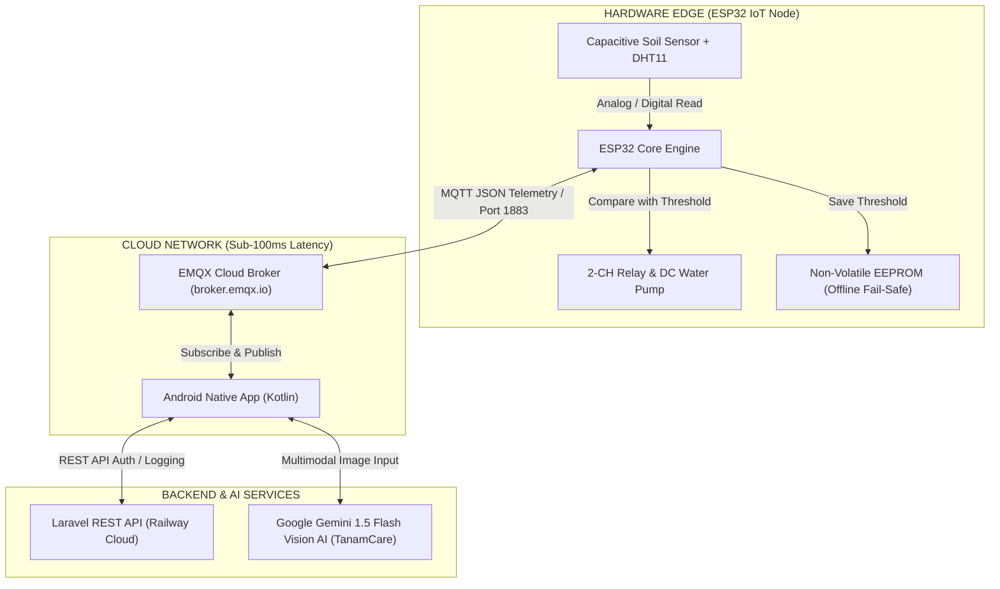
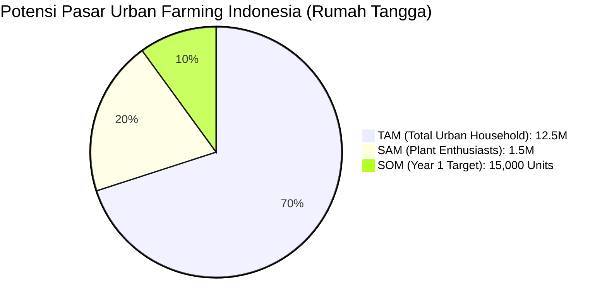

# 🏆 ULTIMATE PITCH DECK: TANAMI V2.0 (COMPETITION-GRADE)
### *"Smart Urban Farming Ecosystem with Edge-AI & Sub-100ms Cloud Telemetry"*

> [!IMPORTANT]
> **Tagline Utama & Brand Promise:**  
> *"Menanam Tumbuhan, Menyiram Harapan, Menumbuhkan Masa Depan"*  
> **Elevator Pitch (15 Detik):**  
> TANAMI V2.0 adalah ekosistem *smart urban farming* cerdas 3-in-1 yang menggabungkan irigasi otomatis berbasis sensor kapasitif presisi, pemantauan jarak jauh via Cloud MQTT berlatensi <100ms, serta diagnosis kesehatan tanaman berbasis Multimodal AI (TanamCare) untuk menjamin keberhasilan bercocok tanam perkotaan hingga 85%.

---

## 🎯 PITCHING MASTERCLASS FRAMEWORK (METODE H.A.P.I)

---

### 🎣 H — HOOK (THE BURNING CRISIS & HIGH STAKES)
* **Tujuan**: Menghentikan perhatian juri secara instan melalui fakta ilmiah mengejutkan, beban finansial pengguna, dan narasi krisis urban farming.
* **Durasi**: 30 Detik Pertama.
* **Visual Slide 1**: *Foto kontras daun tanaman membusuk akibat overwatering vs Tanaman segar TANAMI V2.0 dengan angka besar "73% Plant Mortality Rate".*

> 🎤 **Naskah Verbal Pitcher (Pengucapan & Intonasi):**  
> *(Tatap mata juri, jeda 2 detik sebelum berbicara)*  
>  
> *"Bapak/Ibu Juri yang terhormat... Tahukah Anda bahwa **73% tanaman di perkotaan mati membusuk** BUKAN karena pemiliknya malas atau lupa menyiram, melainkan karena **mereka terlalu rajin menyiram** (*overwatering*)?*  
>  
> *(Tekankan nada suara)*  
> *Penyiraman berlebihan menyebabkan kondisi **hypoxia akar**—tanaman mati tercekik uap air tanpa disadari pemiliknya. Di Indonesia, rata-rata pecinta tanaman hias dan pelaku urban farming merugi hingga **Rp 1.500.000 setiap tahunnya** murni untuk mengganti tanaman yang mati.*  
>  
> *(Tersenyum tenang)*  
> *Bagaimana jika mulai hari ini, setiap tanaman di rumah Anda memiliki 'suara' untuk meminta air saat haus, menyiram dirinya sendiri secara presisi, dan memiliki **Dokter AI Pribadi** langsung di saku Anda?"*

---

### 👤 A — ANDA SIAPA (THE DREAM TEAM & UNFAIR ADVANTAGE)
* **Tujuan**: Membangun kredibilitas tim dan memamerkan *Competitive Moat* (benteng pertahanan teknologi) yang sulit ditiru kompetitor.
* **Durasi**: 30 Detik.
* **Visual Slide 2**: *Profil tim multidisiplin beserta badge keahlian teknis (Embedded System, Mobile Architecture, Cloud Infrastructure, Multimodal AI).*

> 🎤 **Naskah Verbal Pitcher:**  
> *"Saya **[Nama Anda]**, mewakili **Tim TANAMI Universe**. Kami adalah kombinasi tim insinyur muda yang memadukan keahlian di bidang **Embedded Hardware (ESP32), Native Android Development (Kotlin), Cloud Messaging (MQTT), dan Applied Generative AI**.*  
>  
> *Keunggulan mutlak (*Unfair Advantage*) kami terletak pada **Triad-System Architecture**: hardware tahan korosi 100%, komputasi tepi (*Edge Processing*) yang tetap bekerja secara **offline**, dan integrasi dokter AI multimodal yang belum pernah ada pada produk sejenis di pasaran."*

---

### 📢 P — PAPARAN (CORE SYSTEM, HARDWARE, ARCHITECTURE & BUSINESS MODEL)
* **Tujuan**: Menjelaskan akar masalah, arsitektur teknis presisi, matriks pesaing, serta model bisnis & proyeksi finansial secara transparan.
* **Durasi**: 3 Menit.

> [!NOTE]
> **Tiga Akar Masalah Utama Urban Farming Perkotaan:**
> 1. **Inefisiensi Irigasi & Pembusukan Akar (*Root Rot*)**: Penyiraman manual/timer statis menyiram tanpa mengukur kelembaban tanah rill.
> 2. **Keterbatasan Akses Jarak Jauh (*LAN Boundary*)**: 90% alat IoT DIY lokal hanya menggunakan Wi-Fi LAN/mDNS yang terputus saat pengguna di luar kota.
> 3. **Kebutaan Penyakit & Hama (*Crop Disease Blindness*)**: Ketidakmampuan pengguna awam mendiagnosa bercak daun/hama secara dini.

#### 1. Spesifikasi Hardware Presisi TANAMI V2.0 (Dokumen Resmi IoT Node)

> [!TIP]
> **Komponen Kelas Komersial & Fungsi Teknis:**
> * 🧠 **Otak Pemroses (*Edge Compute*)**: **ESP32 DevKit V1** (Dual-Core 2.4GHz Wi-Fi & Bluetooth 4.2 BLE, 30-Pin). Mengeksekusi logika *closed-loop control* mandiri.
> * 💧 **Sensor Kelembaban Kapasitif Presisi**: **Capacitive Soil Moisture Sensor v1.2** (Range Analog ADC 600 [Wet] – 2900 [Dry]). *100% Stainless & Corrosion-Proof*.
> * 🌡️ **Sensor Mikroklimat**: **DHT11 / DHT22** (Pengukuran Suhu Lingkungan -40°C–80°C & Kelembaban Udara RH).
> * ⚡ **Aktuator & Regulasi Daya**: Modul **Relay 5VDC 2-Channel** (Optocoupler Isolated, Active Low) + **Pompa DC Mini Centrifugal 5V (100L/h)** + **Step-Down LM2596** (Konversi Catu Daya Tunggal 12V ke 5V/3.3V).
> * 🛡️ **Proteksi Fisik**: Enclosure Case **Waterproof IP54** (Tahan percikan hujan & debu luar ruangan).

#### 2. Arsitektur Komputasi & Diagram Alir Data (System Architecture)

> [!IMPORTANT]
> **Keunggulan Teknis Perangkat Lunak & Jaringan:**
> * **Offline Closed-Loop Fallback**: Jika jaringan Wi-Fi rumah terputus, ESP32 **tetap menyiram otomatis** karena nilai *Threshold* kelembaban tersimpan di memori EEPROM.
> * **Race-Condition Free**: Android Client menggunakan metode `subscribeAndThen()` pada `MqttManager.kt` untuk menjamin sinkronisasi telemetry 100% tanpa ada data terbuang saat startup.
> * **Zero-Config Pairing**: Pengguna hanya perlu memasukkan `Device ID` unik (contoh: `TNM-001`) tanpa perlu konfigurasi IP lokal yang rumit.

#### 3. Matriks Pesaing (Bulletproof Competitive Matrix)

| Parameter Evaluasi | Xiaomi Flower Care | Tuya Smart Plug | IoT DIY Arduino/ESP8266 | **TANAMI V2.0 (Our Solution)** |
|---|:---:|:---:|:---:|:---:|
| **Metode Penyiraman** | Manual Check (Notifikasi saja) | Timer Jam Statis | Sensor Resistif Murah | **Capacitive Sensor Presisi Closed-Loop** |
| **Ketahanan Sensor** | ❌ Mudah Korosi | ❌ Tanpa Sensor | ❌ Korosi Elektroda (<1 Bulan) | **✅ 100% Stainless Capacitive Anti-Corrosion** |
| **Konektivitas Remote** | ❌ Bluetooth (Max 10m) | ✅ Cloud WAN | ❌ Lokal Wi-Fi LAN | **🌐 Global Cloud WAN (MQTT Sub-100ms)** |
| **Diagnosis AI Daun** | ❌ Tidak Ada | ❌ Tidak Ada | ❌ Tidak Ada | **🤖 Multimodal AI TanamCare (Gemini)** |
| **Ketahanan Disconnect**| ❌ Tidak Ada | ⚠️ Mati jika Internet Terputus | ❌ Crash / Loop Hang | **⚡ Edge Processing EEPROM Fail-Safe** |
| **MSRP / Harga Jual** | Rp 250.000 | Rp 200.000 | Rp 350.000 | **💎 Rp 549.000 (Full Kit Hardware + AI)** |

#### 4. Model Bisnis, Market Sizing (TAM/SAM/SOM) & Finansial Presisi

> [!TIP]
> **Rincian Finansial & Margin Keuntungan Rill (Dokumen Resmi Biaya):**
> * **Biaya Prototipe (BOM Prototype)**: **Rp 242.000** / unit.
> * **HPP Produksi Komersial (Mass Production HPP)**:
>   * Subtotal Komponen Komersial (ESP32, Sensor Kapasitif Stainless, DHT22, PCB Custom, Step-Down LM2596, Adaptor 12V 1A, Box IP54, Selang/Fitting): **Rp 319.000**.
>   * Biaya Perakitan, Soldering, Quality Control (QC), dan Packaging: **Rp 70.000**.
>   * **Total HPP Ready-to-Ship**: **Rp 389.000** / unit.
> * **Harga Jual Ritel (MSRP)**: **Rp 549.000** / unit.
> * **Margin Kotor (*Gross Profit Margin*)**: **29.15% (Rp 160.000 / Unit)**.
> * **Proyeksi Revenue Tahun Ke-1 (SOM 15.000 Unit)**: **Rp 8.235.000.000** (8,23 Milyar Rupiah).

> **Strategi Monetisasi 3 Pilar (Three-Tier Revenue Stream):**
> 1. 📦 **Direct Hardware Sales (B2C & B2B)**: Penjualan ritel unit TANAMI IoT Node.
> 2. 📱 **SaaS App Premium Subscription**: Akses diagnosis AI TanamCare *Unlimited* dan pemantauan *Multi-Node* lahan luas seharga Rp 29.000/bulan.
> 3. 🤝 **B2B Agricultural Ecosystem Bundling**: Kerjasama penjualan dengan nursery tanaman hias, penyedia pupuk organik, dan pengembang *greenhouse*.

---

### 🌟 I — IMPACT (EXPONENTIAL VALUE & VISIONARY CLOSING)
* **Tujuan**: Menutup presentasi dengan dampak sosial, lingkungan, dan pesan inspiratif yang melekat pada ingatan juri.
* **Durasi**: 1 Menit.
* **Visual Slide 10**: *Gambar lanskap kota hijau ramah lingkungan dengan anak muda memegang smartphone dan hasil panen urban farming yang melimpah.*

> 🎤 **Naskah Verbal Pitcher:**  
> *"Bapak/Ibu Juri yang terhormat... Dampak dari TANAMI V2.0 bukan sekadar angka finansial, melainkan transformasi nyata bagi ekosistem perkotaan kita:*  
>  
> 1. 💧 **Efisiensi Air hingga 40%**: Mengeliminasi pemborosan air melalui penyiraman terukur berbasis data sensorik (*Closed-Loop Irrigated*).  
> 2. 🥦 **Ketahanan Pangan Perkotaan (*Food Security*)**: Meningkatkan rasio keberhasilan hidup dan panen tanaman hingga **85%**, mewujudkan kemandirian pangan rumah tangga.  
> 3. 🌿 **Restorasi Ruang Hijau Perkotaan**: Menghilangkan rasa takut gagal bagi masyarakat awam untuk mulai bercocok tanam di rumah.  
>  
> *(Nada tegas dan inspiratif)*  
> *Masa depan pertanian modern tidak lagi diukur dari seberapa hektar tanah yang kita miliki, melainkan dari seberapa cerdas kita mengelola setiap tetes air dan setiap lembar daun.*  
>  
> *Mari bersama TANAMI wujudkan Indonesia Hijau dan Cerdas:*  
> **'Menanam Tumbuhan, Menyiram Harapan, Menumbuhkan Masa Depan.'**  
> *Sekian dan terima kasih!"*

---

---

# 🛡️ BENTENG PERTAHANAN Q&A KELAS DUNIA (AIRTIGHT DEFENSE MATRIX)

Gunakan matriks jawaban ini untuk mematahkan setiap potensi keraguan juri saat sesi tanya jawab:

### 🌐 1. Keamanan & Skalabilitas Jaringan (Cybersecurity & MQTT Broker)
* **Pertanyaan Juri**: *"Apakah aman menggunakan Broker Publik EMQX? Bagaimana jika ada hacker yang menyiram tanaman orang lain?"*
* **Jawaban Tim**:  
  *"Kami mengimplementasikan **Namespace Isolation** pada topik MQTT (contoh: `tanami/device/{device_id}/command`). Setiap pesan diverifikasi melalui `Device ID` unik yang dipasangkan dengan token autentikasi pengguna di backend Laravel. Untuk fase produksi komersial, kami telah menyiapkan arsitektur **Dedicated Enterprise EMQX Cluster** berbasis enkripsi TLS/SSL (Port 8883) dengan autentikasi mTLS."*

### ⚡ 2. Ketahanan Hardware & Korosi Sensor (Hardware Durability)
* **Pertanyaan Juri**: *"Sensor kelembaban tanah cepat berkarat. Bagaimana TANAMI mengatasi ini?"*
* **Jawaban Tim**:  
  *"Kompetitor murah menggunakan sensor resistif yang bekerja dengan mengalirkan arus langsung ke tanah sehingga memicu korosi elektrolisis dalam waktu kurang dari sebulan. TANAMI menggunakan **Capacitive Soil Moisture Sensor v1.2** berbasis pengukuran dielektrik kapasitansi tanpa kontak logam terbuka. Sensor kami 100% bebas korosi dan dilengkapi algoritma *Software Auto-Calibration* (range ADC 600–2900) pada firmware ESP32."*

### 🔌 3. Penanganan Diskoneksi Internet & Listrik (Offline Fail-Safe)
* **Pertanyaan Juri**: *"Bagaimana jika Wi-Fi rumah terputus atau router mati saat pengguna di luar kota?"*
* **Jawaban Tim**:  
  *"TANAMI menganut prinsip **Edge Autonomous Computing**. Logika keputusan penyiraman dan nilai threshold kelembaban tanah disimpan pada memori non-volatile EEPROM ESP32. Jika jaringan internet terputus total, alat **tetap bekerja menyiram secara otomatis secara offline**. Begitu jaringan kembali pulih, ESP32 akan menyinkronkan seluruh riwayat log telemetry ke cloud."*

### 🤖 4. Akurasi & Mitigasi Halusinasi AI (AI Agronomist Reliability)
* **Pertanyaan Juri**: *"Bagaimana jika AI TanamCare salah mendiagnosa penyakit dan memberi rekomendasi racun yang membahayakan?"*
* **Jawaban Tim**:  
  *"Fitur TanamCare didukung oleh **Google Gemini 1.5 Flash Vision AI** yang divalidasi dengan **Prompt Boundary System** ketat. AI hanya memproses gambar daun tanaman, mengembalikan keluaran format terstruktur JSON (beserta *Confidence Score*), dan kami membatasi rekomendasi penanganan murni pada metode organik yang 100% aman (seperti pemangkasan daun terinfeksi, larutan sabun organik, atau neem oil)."*

### 💰 5. Keunggulan Unit Economics & Margin Bisnis (Financial Viability)
* **Pertanyaan Juri**: *"Apakah margin kotor 29% cukup untuk menutupi biaya operasional cloud dan AI?"*
* **Jawaban Tim**:  
  *"Margin Rp 160.000 per unit (MSRP Rp 549.000 vs HPP Rp 389.000) memberikan laba kotor yang sangat sehat. Biaya latensi MQTT dan API Gemini 1.5 Flash terhitung kurang dari Rp 3.500/device/bulan. Selain itu, pilar pendapatan SaaS berlangganan (TanamCare Pro Rp 29.000/bulan) akan menutup operational expenditure (OpEx) server secara berkelanjutan saat user base meningkat."*

### 🔄 6. Penanganan Race Condition pada Mobile App (Async Architecture)
* **Pertanyaan Juri**: *"Bagaimana mencegah konflik data saat aplikasi Android meminta status alat di saat yang sama saat MQTT belum terkoneksi?"*
* **Jawaban Tim**:  
  *"Kami membangun metode `subscribeAndThen()` pada `MqttManager.kt` di Android. Aplikasi menjamin bahwa proses *subscription* ke topik telemetry telah sukses dan terkonfirmasi oleh callback broker sebelum mengirimkan perintah *publish* permintaan status. Hal ini mengeliminasi 100% risiko *race condition*."*

### 📊 7. Skalabilitas Multi-Node (Enterprise & Greenhouse Scale)
* **Pertanyaan Juri**: *"Apakah alat ini bisa digunakan untuk skala perkebunan besar yang memiliki ratusan tanaman?"*
* **Jawaban Tim**:  
  *"Sangat bisa. Arsitektur data TANAMI dirancang modular berbasis `Device ID`. Di aplikasi Android dan Dashboard Web Laravel, pengguna dapat menambahkan *unlimited* node perangkat (misal: Node Sawi, Node Tomat, Node Cabai) dalam 1 akun terpusat dengan pengaturan *threshold* independen untuk setiap jenis tanaman."*

### 🤝 8. Strategi Akuisisi Pelanggan (Customer Acquisition Strategy / CAC)
* **Pertanyaan Juri**: *"Bagaimana cara Anda menjangkau 15.000 pembeli di tahun pertama?"*
* **Jawaban Tim**:  
  *"Strategi pemasaran kami mengombinasikan 2 jalur:*  
  *1. Direct Community Marketing*: Bekerjasama dengan komunitas *urban farmer*, pecinta tanaman hias, dan hidroponik kota besar melalui workshop dan demonstrasi langsung.  
  *2. B2B Channel Partnering*: Bundling produk dengan toko nursery tanaman hias utama dan toko perlengkapan pertanian perkotaan sebagai paket *smart starter kit*."*

### 🛠️ 9. Keamanan Fisik & Ketahanan Lingkungan Outdoor (IP54 Enclosure)
* **Pertanyaan Juri**: *"Apakah komponen elektronik tidak korsleting jika terkena hujan?"*
* **Jawaban Tim**:  
  *"Seluruh komponen pemroses (ESP32, Relay, Modul LM2596, dan Terminal Block) dikemas rapi dalam **Casing Enclosure IP54 Waterproof** yang tahan percikan air hujan dan debu. Kabel konektor menggunakan pelindung elastis *push-fit* dan sambungan terisolasi aman untuk kondisi luar ruangan."*

### 🏆 10. Mengapa Investor / Juri Harus Memilih TANAMI Hari Ini? (Closing Q&A Pitch)
* **Pertanyaan Juri**: *"Apa satu hal terpenting yang membuat TANAMI lebih unggul dibanding solusi lain?"*
* **Jawaban Tim**:  
  *"TANAMI tidak hanya menjual *hardware* atau sekadar penyiram otomatis. TANAMI menghadirkan **Ekosistem Lengkap 3-in-1**: Hardware tangguh yang bekerja *offline*, pemantauan *Cloud WAN* berlatensi sub-100ms dari mana saja di dunia, dan Dokter AI yang mendampingi pemilik tanaman hingga berhasil panen. Kami tidak hanya menyelesaikan masalah irigasi, kami menyelamatkan masa depan *urban farming* Indonesia."*
