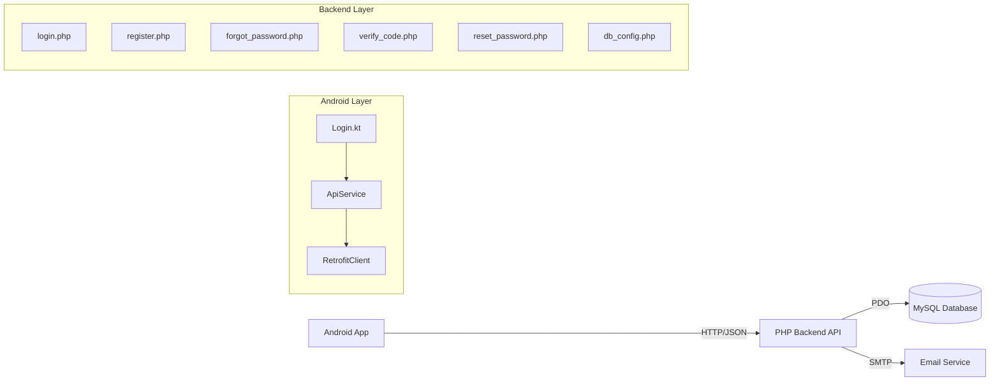

# Tanami Database Integration Plan

Integrasi aplikasi Android Tanami dengan database MySQL melalui PHP backend API untuk fitur authentication (register, login, forgot password, reset password).

## User Review Required

> [!IMPORTANT] > **Konfirmasi lokasi backend**: Berdasarkan `RetrofitClient.kt`, API akan di-deploy ke `http://192.168.1.72/tanami-api/api/`. Apakah lokasi ini sudah benar? Jika berbeda, harap konfirmasi.

> [!WARNING] > **Email configuration**: Flow forgot password membutuhkan SMTP untuk mengirim email. Apakah Anda sudah memiliki konfigurasi email (Gmail SMTP, Mailgun, dll)?

---

## Architecture Overview



---

## Proposed Changes

### Backend API (PHP)

> [!NOTE]
> Semua file PHP akan dibuat di folder server terpisah, bukan di dalam project Android.
> Lokasi: `/var/www/html/tanami-api/api/` atau sesuai konfigurasi Anda.

---

#### [NEW] db_config.php

Konfigurasi koneksi database MySQL menggunakan PDO.

```php
// Database: tanami_dummy
// Tables: users, password_resets
```

---

#### [NEW] register.php

- **Method**: POST
- **Request Body**: `{ nama, email, password, password_confirmation }`
- **Response**: `{ success, message, data: { id, nama, email, token } }`
- **Logic**:
  1. Validasi email unik
  2. Validasi password match
  3. Hash password dengan `password_hash()`
  4. Insert ke tabel `users`

---

#### [NEW] login.php

- **Method**: POST
- **Request Body**: `{ email, password }`
- **Response**: `{ success, message, data: { id, nama, email, token } }`
- **Logic**:
  1. Cari user berdasarkan email
  2. Verifikasi password dengan `password_verify()`
  3. Generate token (opsional)
  4. Return user data

---

#### [NEW] forgot_password.php

- **Method**: POST
- **Request Body**: `{ email }`
- **Response**: `{ success, message }`
- **Logic**:
  1. Validasi email exists di `users`
  2. Generate 6-digit code
  3. Simpan ke `password_resets` dengan `expires_at` (15 menit)
  4. Kirim email dengan kode verifikasi

---

#### [NEW] verify_code.php

- **Method**: POST
- **Request Body**: `{ email, code }`
- **Response**: `{ success, message, reset_token }`
- **Logic**:
  1. Cari record di `password_resets` dengan email + code
  2. Validasi belum expired
  3. Generate `reset_token`
  4. Update record dengan token

---

#### [NEW] reset_password.php

- **Method**: POST
- **Request Body**: `{ email, reset_token, password, password_confirmation }`
- **Response**: `{ success, message }`
- **Logic**:
  1. Validasi `reset_token` valid
  2. Validasi password match
  3. Update password di `users`
  4. Hapus record di `password_resets`

---

### File Structure

```
tanami-api/
├── api/
│   ├── db_config.php          # Database connection
│   ├── register.php           # POST: User registration
│   ├── login.php              # POST: User login
│   ├── forgot_password.php    # POST: Request reset code
│   ├── verify_code.php        # POST: Verify reset code
│   ├── reset_password.php     # POST: Set new password
│   ├── get_all_tanaman.php    # (existing)
│   ├── get_detail_tanaman.php # (existing)
│   └── search_tanaman.php     # (existing)
└── images/                    # (existing) Plant images
```

---

## Verification Plan

### Automated Tests

**Testing dengan cURL (dari terminal)**

1. **Test Register**

```bash
curl -X POST http://192.168.1.72/tanami-api/api/register.php \
  -H "Content-Type: application/json" \
  -d '{"nama":"Test User","email":"test@example.com","password":"password123","password_confirmation":"password123"}'
```

2. **Test Login**

```bash
curl -X POST http://192.168.1.72/tanami-api/api/login.php \
  -H "Content-Type: application/json" \
  -d '{"email":"test@example.com","password":"password123"}'
```

3. **Test Forgot Password**

```bash
curl -X POST http://192.168.1.72/tanami-api/api/forgot_password.php \
  -H "Content-Type: application/json" \
  -d '{"email":"test@example.com"}'
```

---

### Manual Verification

1. **Test dari Android App**:

   - Jalankan aplikasi Tanami
   - Coba register user baru
   - Logout, lalu login dengan kredensial tadi
   - Coba fitur lupa sandi

2. **Cek database langsung**:
   - Buka phpMyAdmin
   - Verifikasi data di tabel `users` dan `password_resets`

---

## Questions for User

1. **Lokasi deploy PHP**: Di mana folder `tanami-api` seharusnya berada? (contoh: `/var/www/html/tanami-api/`)

2. **SMTP Configuration**: Apakah Anda memiliki akses SMTP untuk forgot password? Jika tidak, kita bisa skip fitur email dan langsung tampilkan kode di response (untuk testing).

3. **Existing tanaman API**: Apakah file `get_all_tanaman.php` dll sudah ada dan berfungsi?
